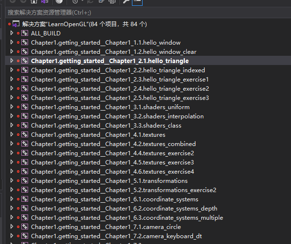

# LearnOpenglEmpty

## 目的

学opengl的人不被环境困扰。

## Build

**Win**

前置要求：安装了cmake和201X版本visual studio。
运行build_windows.bat 然后打开工程build/LearnOpenGL.sln 如下图所示,这些工程里面都是空的只有一个Main但是环境是可以的 直接在里面写代码就可以。（只有这个画三角形的有代码，其他都是空的，学习者往里面写自己的代码，然后不需要关心环境的问题，先专注到内容本身）

**Mac**

暂时不support

## Run

